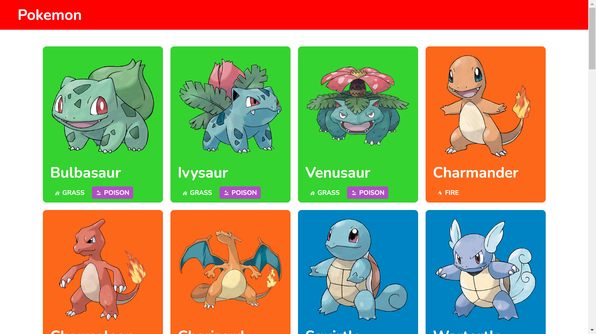
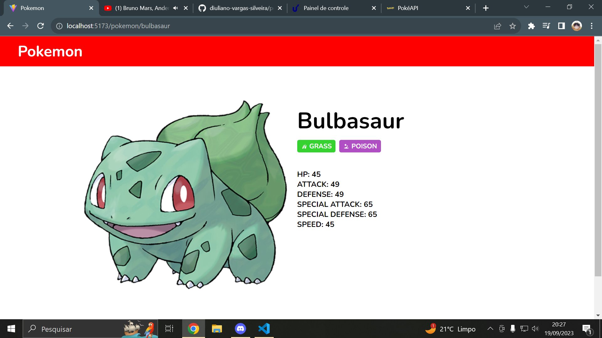

# Pokemon

## Overview

The Pokemon is a web application that allows users to view all Pokemons. It is built using React.js, TypeScript, and Vite, and it utilizes a Pokemon API to provide up-to-date Pokemons information.

### Pokemon List



### Pokemon Detail



## Technology

Here are the technologies used in this project.

- React.js
- TypeScript
- Sass
- Vite.js

## Features

- **Pokedex:** Users can see all Pokemons, he can scroll down to get new Pokemons in the list.
- **Pokemon:** User can see Pokemon types and stats.

## Installation

To run the Pokemon locally follow these steps:

1. Clone this repository to your local machine.

   ```bash
   git clone https://github.com/diuliano-vargas-silveira/pokemon.git
   ```

2. Navigate to the project directory.

   ```bash
   cd pokemon
   ```

3. Install dependencies using npm

   ```bash
   npm install
   ```

## Usage

1. On the homepage, you will see the 40 firstest Pokemons.

2. Click in a Pokemon card you can see it detailed.

## Acknowledgments

- The Pokemon was built using various open-source libraries and resources. We would like to thank the open-source community for their contributions.

- Pokemon data is provided by [Pokemon API](https://pokeapi.co/).

## Contact

If you have any questions or feedback, please feel free to contact us at [diulianovargas@gmail.com](diulianovargas@gmail.com).

Happy pokemon checking!
